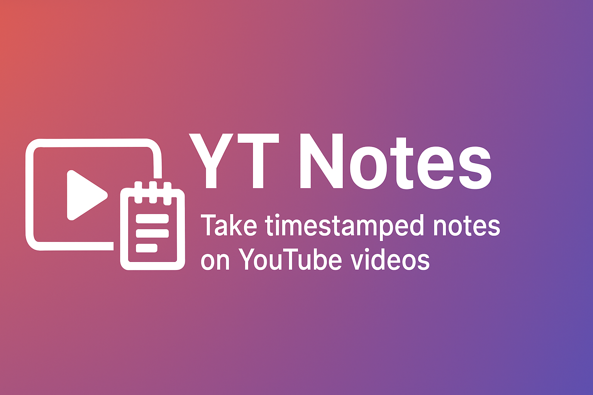

<p align="center">
  
</p>


# YT Notes 🎥📝

YT Notes is a Chrome extension that helps you take timestamped notes directly on YouTube videos.  
Each note is linked to the exact moment in the video, so you can instantly jump back just by clicking on it.  

It also supports **exporting** and **importing** notes, making it easy to share or back them up.

---

## ✨ Features
- 📌 Add notes at the current timestamp while watching YouTube.
- ⏱️ Click a note to instantly jump to that time in the video.
- 📤 Export your notes and share them with others.
- 📥 Import notes back into the extension.
- 🎨 Clean and minimal interface.

---

## 📦 Installation
1. Download the file from the main page of this repository.
2. Open Chrome and go to chrome://extensions/
3. Enable Developer mode (top-right corner).
4. Click on Load unpacked and select the extension folder.
5. Done! 🎉

---

## 🚀 Usage
1. Open any YouTube video (works in lives also).
2. Click the YT Notes button near the video (next to Subscribe button).
3. The video will pause, and you can write a note tied to the current timestamp.
4. Click on any saved note to jump back to that moment.
5. Use the Export/Import option to save or share notes.

--- 

## 🛠️ Tech Stack
```
• JavaScript (Chrome Extension APIs)
• HTML, CSS (UI)
• Local Storage + JSON (for saving and exporting notes)
```

---

## 🗂️ Project Structure
```
yt-notes/
│
├── manifest.json # Extension config
├── content.js # Injected into YouTube pages
├── styles.css # Styling
├── aseets/  #banner
└── icons/ # Extension icons
```
---

## 🤝 Contributing
Pull requests and feature suggestions are welcome!
For major changes, please open an issue first to discuss what you’d like to change.

---

## 💡 Inspiration
I got this idea from PW (physics wallah). They use the same feature like this in their video lectures, so im used to this feature but when i watch lectures in youtube it becomes difficult for me to make tracks of topics
and question through out that whole lectures so i made this small extension which is minimal but very usefull...!!
I didn't had money to upload it on chrome webstore that's why i posted it here.
So make usefull of it,
Thanks.

## 📄 License
This project is licensed under the [MIT License]
